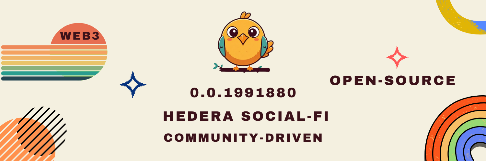
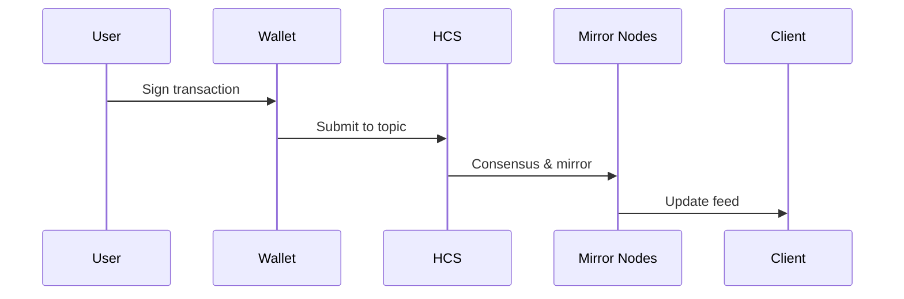

# SocialFi on Hedera

# iBird is an Open-Source, Community-Driven, Web3 Social Media Built on Hedera

iBird - A Decentralized Social Media Platform

## Introduction

iBird is a decentralized social media platform built on the Hedera Hashgraph network, leveraging its Hedera Consensus Service (HCS) and Hedera Token Service (HTS). The platform aims to provide a censorship-resistant, open-source, and user-controlled environment for social interactions, content creation, and sharing.



## Key Features 🌟

- **Post Messages**: Share your thoughts with text and media
- **Create Threads**: Start conversations and discussions
- **Create Polls**: Get community opinions
- **Tip Content Creators**: Support your favorite creators directly
- **Own Your Profile**: Your profile is an NFT that you control
- **Censorship Resistant**: No central authority can remove your content
- **Media Storage**: All media is stored on Arweave for permanence

## Architecture

iBird consists of two main components:

1. **Backend: Hedera Hashgraph Network**

   - **Hedera Consensus Service (HCS):** Used for creating decentralized, auditable logs of timestamped events.
   - **Hedera Token Service (HTS):** Used for creating and managing user profile NFTs.

2. **Frontend: User Interface and Logic**
   - Handles the interface and user interactions.
   - Includes the logic for writing data to and reading data from the Hedera network.

### Data Flow Architecture 🔄

1. **Message Publishing Flow**

   - User creates content
   - Content is serialized to JSON
   - Media (if any) is uploaded to Arweave
   - Message is submitted to appropriate HCS topic
   - Message is mirrored across the network
   - Client applications receive updates via mirror nodes

2. **Topic Hierarchy**

   ```
   Root
   ├── Universal Explorer (0.0.4976953)
   │   ├── Posts
   │   ├── Thread References
   │   ├── Poll References
   │   └── Repost References
   │
   └── User Profiles
       ├── Profile Topic
       │   └── Profile Information
       └── User Messages Topic
           ├── Personal Posts
           ├── Thread Participations
           ├── Poll Participations
           └── Repost Participations
   ```

3. **NFT Profile System**
   - Metadata contains:
     - Profile Topic ID
     - User Messages Topic ID
     - Account ID
     - Creation timestamp

## Data Structure and Communication

<!-- 1. **[Universal](https://hashscan.io/mainnet/topic/0.0.4976953) Explorer** -->

1.  **Universal Explorer**

    - All posts, threads, and polls are recorded on this public topic.
    - Enables reading of all messages sent by users on iBird.
    - Explore Topic:

      ```json
      {
        "Type": "Post",
        "Message": "Free speech is paramount, but in our current landscape, it's under threat. iBird emerges as a sanctuary for unfiltered expression, protected by Hedera, ensuring our voices soar beyond the reach of censorship.🎙️",
        "Media": null
      }
      ```

      ```json
      { "Type": "Thread", "Thread": "0.0.5706419" }
      ```

      ```json
      { "Type": "Poll", "Poll": "0.0.5679056" }
      ```

2.  **Message Types**

    - **Posts**

      - A simple way to broadcast your message on Hedera. Posts do not support interactive features like replies or likes.

      - Post in Explore Topic:

        ```json
        {
          "Type": "Post",
          "Message": "Free speech is paramount, but in our current landscape, it's under threat. iBird emerges as a sanctuary for unfiltered expression, protected by Hedera, ensuring our voices soar beyond the reach of censorship.🎙️",
          "Media": null
        }
        ```

        - Total Network Fee: $0.0001

          | Fee Type | Amount  |
          | -------- | ------- |
          | Post     | $0.0001 |

    - **Threads**

      - A thread enables users to engage in deeper, focused discussions on particular subjects. Each thread starts with an initial topic message and can encompass a wide range of responses and interactions.
      - Thread Topic in Explore Topic:
        ```json
        { "Type": "Thread", "Thread": "0.0.5706419" }
        ```
      - Thread Topic:

        ```json
        {
          "Message": "On iBird, every conversation, every interaction, is a step towards a freer digital world. Engage, create, share, and do it on your terms. Welcome to the future of social networking.",
          "Media": null
        }
        ```

        - Total Network Fee: $0.0104

          | Fee Type                | Amount  |
          | ----------------------- | ------- |
          | Creating Thread Topic   | $0.01   |
          | Initiating Thread Topic | $0.0001 |
          | Publishing on Explore   | $0.0001 |
          | Adding To User Messages | $0.0001 |
          | Sending Message         | $0.0001 |

      - Writing Comments:

        ```json
        {
          "Author": "0.0.123456",
          "Reply_to": "sequence Number of the message we want to write comment for",
          "Message": "Hi"
        }
        ```

        - Total Network Fee: $0.0001

          | Fee Type        | Amount  |
          | --------------- | ------- |
          | Sending Comment | $0.0001 |

      - Liking a Message:

        ```json
        {
          "Author": "AccountId1",
          "Like_to": "sequenceNumber of the message we want to like"
        }
        ```

        - Total Network Fee: $0.0001

          | Fee Type     | Amount  |
          | ------------ | ------- |
          | Sending Like | $0.0001 |

      - Disliking a Message:

        ```json
        {
          "Author": "AccountId1",
          "Dislike_to": "sequenceNumber of the message we want to dislike"
        }
        ```

        - Total Network Fee: $0.0001

          | Fee Type        | Amount  |
          | --------------- | ------- |
          | Sending DisLike | $0.0001 |

    - **Polls**

      - Polls are used to gauge opinions or votes on specific questions or propositions. Similar to threads, each poll is associated with a unique topic where all votes and options are recorded.
      - Poll Topic in Explore Topic:
        ```json
        {
          "Type": "Poll",
          "Poll": "0.0.5679056"
        }
        ```
      - Poll Topic:

        ```json
        {
          "Message": "Question?",
          "Media": "ar://bafkreicsd3imsxhqyjbew2uldrojftxkwcz2w2zjs2jjismdf4d75ns7hu",
          "Choice1": "A",
          "Choice2": "B",
          "Choice3": null,
          "Choice4": null,
          "Choice5": null
        }
        ```

        - Total Network Fee: $0.0104

          | Fee Type                | Amount  |
          | ----------------------- | ------- |
          | Creating Poll Topic     | $0.01   |
          | Initiating Poll Topic   | $0.0001 |
          | Publishing on Explore   | $0.0001 |
          | Adding To User Messages | $0.0001 |
          | Sending Message         | $0.0001 |

      - Voting:

        ```json
        {
          "Choice": "selectedChoice"
        }
        ```

        - Total Network Fee: $0.0001

          | Fee Type     | Amount  |
          | ------------ | ------- |
          | Sending Vote | $0.0001 |

    - **Reposts**

      - Reposts allow users to share and amplify existing content. When a user reposts, a reference is created in the Explore Topic.
      - Repost Reference in Explore Topic:

        ```json
        {
          "Type": "Repost",
          "ContentType": "Thread",
          "Source": "0.0.5706419"
        }
        ```

      - Total Network Fee: $0.0002

        | Fee Type                | Amount  |
        | ----------------------- | ------- |
        | Publishing on Explore   | $0.0001 |
        | Adding To User Messages | $0.0001 |

3.  **Media Storage**

    - All media files are stored on Arweave.

      ```json
      {
        "Type": "Post",
        "Message": "ASSET Token holders have just received their income share from iBird, the open-source, community-driven, web3 social media built on hedera.",
        "Media": "ar://bafkreic35uavltr2pb6gsoisv54fytj77felckswkzlglakt25vcbpil6y"
      }
      ```

## User Profiles

When a user creates a profile:

1. A USER MESSAGES topic is created to save the user's messages.
2. A USER PROFILE TOPIC is created to store user information and the USER MESSAGES topic.
3. A user profile NFT is minted, with the USER PROFILE TOPIC added as metadata.
4. The user has full control over their profile NFT, which is saved in their wallet.
5. To update profile information, the user sends a new message to the USER PROFILE TOPIC, and iBird reads the last message as the current user profile data.

   - User Profile Topic:

     ```json
     {
       "Identifier": "iAssets",
       "Type": "Profile",
       "Author": "0.0.5706201",
       "Name": "iAssets",
       "Bio": "iBird is an Open-Source, Community-Driven, Web3 Social Media Built on Hedera by iAssets.",
       "Website": "ibird.community",
       "Location": "",
       "UserMessages": "0.0.5706263",
       "Picture": "ar://bafkreieltouugsbgruyd7u2pbwlp2oe2xd7scmvjzdkgv6a7a6gosksram",
       "Banner": null
     }
     ```

   - User Messages Topic is just like Explore Topic but only save user messages:

     ```json
     {
       "Type": "Post",
       "Message": "Free speech is paramount, but in our current landscape, it's under threat. iBird emerges as a sanctuary for unfiltered expression, protected by Hedera, ensuring our voices soar beyond the reach of censorship.🎙️",
       "Media": null
     }
     ```

     ```json
     { "Type": "Thread", "Thread": "0.0.5706419" }
     ```

     ```json
     { "Type": "Poll", "Poll": "0.0.5679056" }
     ```

     - Total Network Fee: $1.0402

       | Fee Type                       | Amount  |
       | ------------------------------ | ------- |
       | Creating User Messages Topic   | $0.01   |
       | Initiating User Messages Topic | $0.0001 |
       | Creating User Profile Topic    | $0.01   |
       | Initiating User Profile Topic  | $0.0001 |
       | Creating User Profile NFT      | $1      |
       | Minting User Profile NFT       | $0.02   |

#### Transaction Flow

**Content Creation**



## Tipping and Rewards

- iBird supports user tipping, with 99% of each tip going to the content creator and 1% to iBird for platform improvement.

## Open Source and Decentralization

- iBird is open-source, allowing anyone to download and run the platform on their system.
- The platform does not rely on centralized servers, making it fully decentralized.

## Future Plans

- Develop mobile applications for iBird.
- Quote feature enabling users to share and comment on existing posts while preserving attribution.
- Solve the challenge of storing follower and following relationships on-chain.

## Getting Started 🚀

1. Connect your Hedera wallet
2. Create your profile (costs ~$1.04)
3. Start posting, commenting, and engaging!

## Building Together

iBird leverages the power of the Hedera Hashgraph network to create a decentralized, censorship-resistant social media platform. By utilizing HCS for message ordering and timestamping, HTS for user profile management, and Arweave for media storage, iBird offers a unique and innovative approach to social networking. The open-source nature of the platform ensures transparency and allows for community-driven development, while the decentralized architecture provides users with control over their data and interactions. Feel free to participate in the project, propose improvements, or raise issues. Whether you're making changes to the existing code or suggesting new features, your contribution will shape the future!

## License

This project is anchored by the Creative Commons Attribution-NonCommercial 4.0 International Public License - see the [LICENSE](LICENSE.md) file for details.
